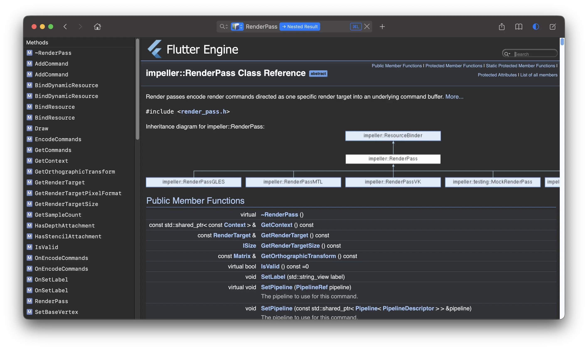
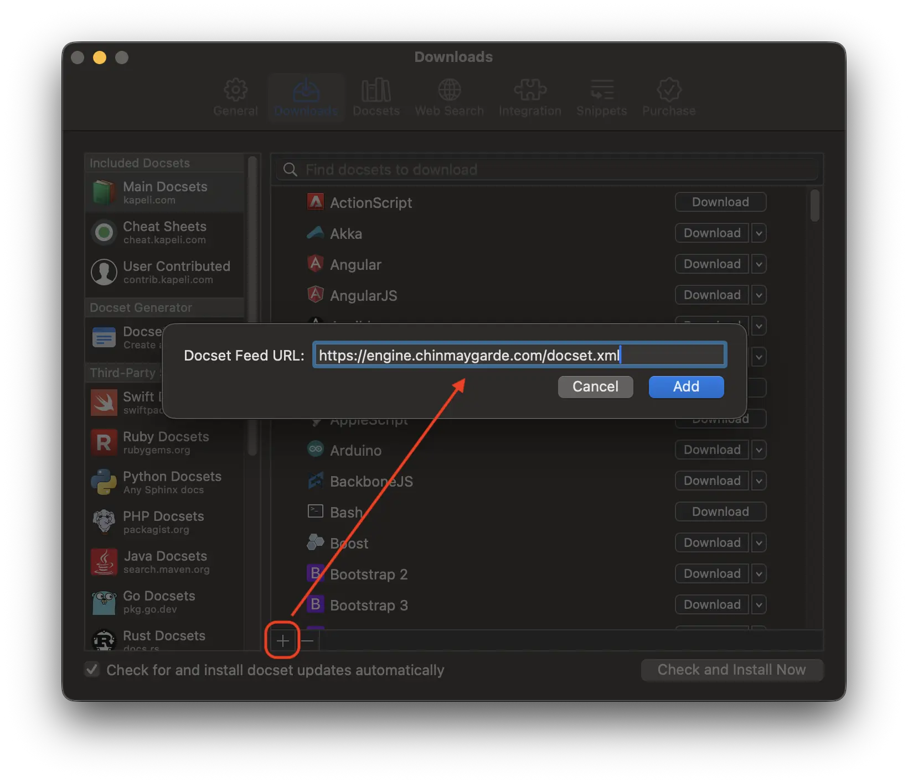

# Flutter Engine Documentation Generator

## Website

A self-updating feed of the [Doxygen documentation generated from Flutter Engine source is located here](https://engine.chinmaygarde.com).

## Dash Docset

A Dash Docset from the same documentation is also generated and the following self-updating feed can be added to Doxygen:

```sh
https://engine.chinmaygarde.com/docset.xml
```

Subscribe to this feed in Dash using `Preferences` -> `Downloads` -> `+` icon at the bottom, and pasting in that feed.



